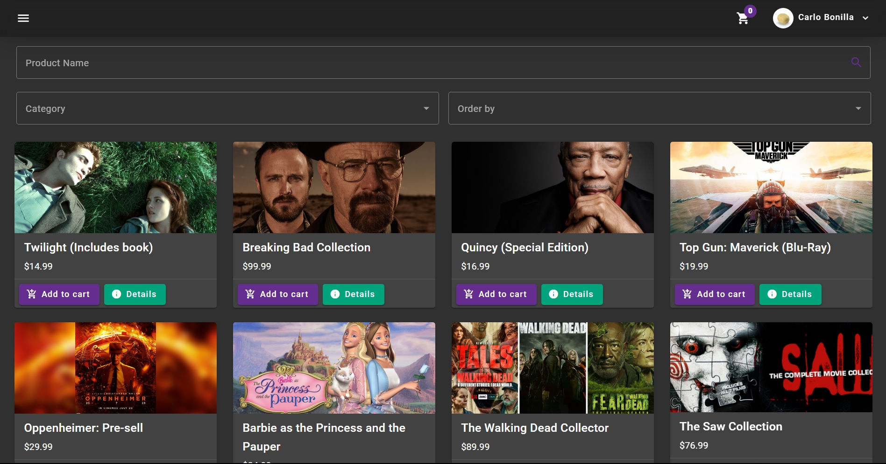

# AnyMovie 🎥



## Introduction

This documentation provides an overview of the Marketplace application project. The application is built using Angular 16, Node.js, Express, MySQL, and Prisma ORM. The project aims to create a modern marketplace platform.

## Table of Contents

- [AnyMovie 🎥](#anymovie-)
  - [Introduction](#introduction)
  - [Table of Contents](#table-of-contents)
  - [Features](#features)
  - [Technologies Used](#technologies-used)
  - [Installation](#installation)


## Features

- User authentication (sign in and sign up using JWT)
- Angular Material for UI components
- Product maintenance including CRUD operations
- Functional Shopping Cart
- Seller reviews and ratings
- Different roles for users (client, admin, seller)
- Modern design and user-friendly interface
- Product filters for easy navigation
- User settings and profile management
- Address management for users
- Reports and analytics for admin and sellers using Chart.js
- Separate frontend (client) and backend (server) folders

## Technologies Used

Front-End: 
- Angular 16
- Angular Material
- Bootstrap
- Chart.js

Back-End: 
- Node.js
- Express
- MySQL
- Prisma (ORM)

## Installation

Requisites: Angular CLI, Node v18+, MySQL 

Server:

1. (In your terminal) Clone the repository to your local machine using
```bash 
git clone https://github.com/alfres2503/any-movie.git
```
2. Navigate to the client app:
```bash
cd any-movie/server
```
3. Install the required dependencies using 
```bash
npm install
```
4. Set up the database using: (set your mysql credentials in the .env file) 
```bash
npx prisma migrate dev
```
5. Run the application using: 
```bash
npm run dev
```

Client:

1. Navigate to the client app:
```bash
cd any-movie/client/app
```
1. Install the required dependencies using 
```bash
npm install
```
1. (Having angular CLI installed in your system) Run the application using: 
```bash
ng serve
```

Contributions to the AnyMovie are welcome! If you find any bugs, have suggestions for new features, or would like to contribute in any other way, please submit an issue or create a pull request on the GitHub repository.